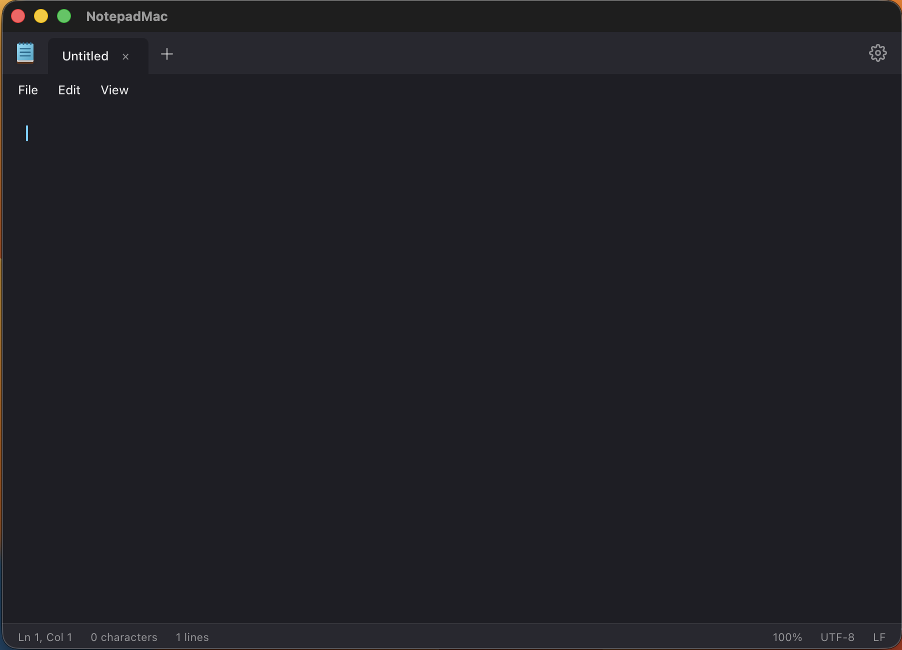
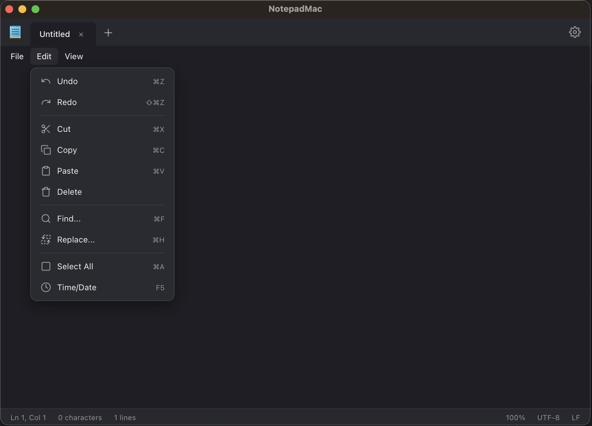
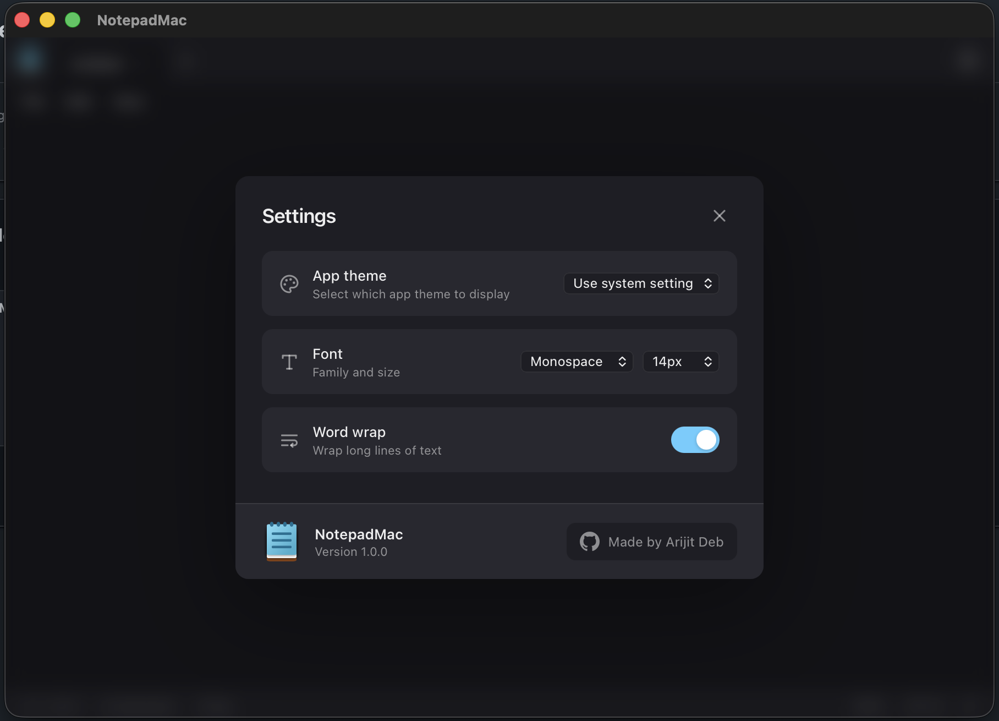

# NotepadMac

A modern, fast, and lightweight Notepad for macOS, built with Tauri, React, and TypeScript.

[](https://github.com/Arijit-gotsomecodes/NotepadMac---Windows-Notepad-For-Mac/releases/download/app-v1.0.3/NotepadMac_1.0.3_aarch64.dmg)
[](https://github.com/Arijit-gotsomecodes/NotepadMac---Windows-Notepad-For-Mac/releases/download/app-v1.0.3/NotepadMac_1.0.3_x64.dmg)

[Notice] Some apple silion laptop might face issue while first opeaning the app see Troubleshooting Section for fix

## Features

- **Lightweight & Fast**: Built with Rust and Tauri for minimal resource usage.
- **Tabbed Interface**: Work on multiple files simultaneously.
- **Auto-Save & Unsaved Changes Prompt**: Never lose your work accidentally.
- **Cross-Platform Architecture**: Designed with cross-platform compatibility in mind.

## Screenshots





## Development

This template should help get you started developing with Tauri, React and Typescript in Vite.

### Recommended IDE Setup

- [VS Code](https://code.visualstudio.com/) + [Tauri](https://marketplace.visualstudio.com/items?itemName=tauri-apps.tauri-vscode) + [rust-analyzer](https://marketplace.visualstudio.com/items?itemName=rust-lang.rust-analyzer)

### Installation

#### Install via Homebrew
```bash
brew tap Arijit-gotsomecodes/NotepadMac---Windows-Notepad-For-Mac https://github.com/Arijit-gotsomecodes/NotepadMac---Windows-Notepad-For-Mac.git
brew install notepadformac
```

#### Install via Source
```bash
npm install
npm run tauri dev
```

### Build

```bash
npm run tauri build
```

### Troubleshooting

#### "App is damaged and can't be opened" (Apple Silicon)

If you are using an Apple Silicon Mac (M1/M2/M3) and receive a "damaged app" error when trying to open the `.dmg` or `.app`, this is due to macOS Gatekeeper's strict quarantine policies for unsigned ARM64 applications downloaded from the internet. The Intel (x86_64) build often works via Rosetta 2 because its restrictions are slightly looser.

To fix this, you must remove the quarantine flag. Open your Terminal and run the following command against the extracted application:

```bash
xattr -cr /Applications/NotepadMac.app
```
*(Adjust the file path if you placed the app somewhere other than the Applications folder.)*

## 🤝 Contributing

We welcome contributions from the community! Whether you're fixing a bug, improving the UI, or adding new features, your help is appreciated.

### How to Contribute

1.  **Fork the Repository**: Click the "Fork" button at the top right of this page.
2.  **Clone your Fork**:
    ```bash
    git clone https://github.com/Arijit-gotsomecodes/NotepadMac---Windows-Notepad-For-Mac.git
    ```
3.  **Create a Branch**:
    ```bash
    git checkout -b feature/amazing-feature
    ```
4.  **Make Changes**: Write your code and ensure it works locally.
5.  **Commit Changes**:
    ```bash
    git commit -m "Add some amazing feature"
    ```
6.  **Push to Branch**:
    ```bash
    git push origin feature/amazing-feature
    ```
7.  **Open a Pull Request**: Go to the original repository and create a Pull Request.

### Areas We Need Help With

- **UI/UX Improvements**: Making the app feel even more native on macOS.
- **Additional Features**: Line Numbers customizations, Syntax Highlighting.
- **Performance Optimizations**: Keeping the app lightweight.
- **Bug Fixes**: Identifying and squashing any issues.

Don't hesitate to open an issue if you have ideas or find bugs!
